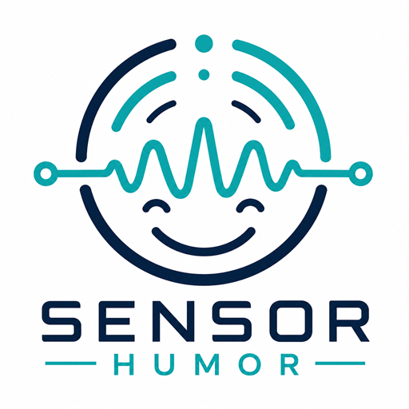

<p align="center">
  <a href="README.md">English</a> | <a href="README.zh.md">中文</a> | <a href="README.es.md">Español</a> | <a href="README.fr.md">Français</a> | <a href="README.hi.md">हिन्दी</a> | <a href="README.it.md">Italiano</a> | <a href="README.pt-BR.md">Português (BR)</a>
</p>

<p align="center">
  
</p>

<p align="center">
  <a href="https://www.npmjs.com/package/@mcptoolshop/sensor-humor"></a>
  <a href="https://github.com/mcp-tool-shop-org/sensor-humor/actions/workflows/ci.yml"></a>
  <a href="https://github.com/mcp-tool-shop-org/sensor-humor/blob/main/LICENSE"></a>
  <a href="https://mcp-tool-shop-org.github.io/sensor-humor/"></a>
</p>

LLMに、常にユーモラスな相棒のような役割を与えるMCPツールです。感情に基づいた個性、セッションを意識したコールバック、繰り返されるジョーク、皮肉、からかい、お決まりのフレーズなど、すべてPiper TTS（抑揚制御）を通じて音声統合されます。

開発者向けに設計されています。コードの問題点に対する穏やかな批判、簡潔で冷静なエラーメッセージ、ビルド失敗時の混沌としたエスカレーションを行います。ホストLLMのトーンを上書きすることはありません。呼び出されたときに響く、独特の声です。

## 機能

- 6つの感情があり、それぞれ予測可能で高品質な出力を得るために、穴埋め形式のプロンプトで調整されています。
- セッション状態：繰り返されるジョーク、最近の面白い発言のリングバッファ（最大20）、お決まりのフレーズマップ—オプションでディスクに保存され（`SENSOR_HUMOR_PERSIST`）、サーバー再起動後もコールバックが維持されます。
- 9つのツール：mood_set/mood_get、comic_timing、roast、heckle、catchphrase_generate/catchphrase_callback、debug_status、session_reset
- ローカルのOllamaバックエンド（デフォルトはqwen2.5:7b、`SENSOR_HUMOR_MODEL`で設定可能）
- 音声ペアリング：mcp-voice-soundboardとPiper TTS（抑揚調整ノブ：length_scale、noise_scale、noise_w_scale、volume）
- 決定性：JSONスキーマの強制、検証、不良出力時の再試行、感情の継承を強制します。

## 感情

各感情は、モデルを予測可能で高品質な状態に導くための穴埋め形式のプロンプトを使用します。

- **dry** — 冷静沈着、ミニマリスト、痛いほど明白（デフォルト）
- **roast** — 友好的な辛辣な批判、評価/診断ラベル
- **cynic** — 世知辛い、静かながらも容赦のないリアリズム（「もちろん」、「予想通り」）
- **cheeky** — 遊び心のあるいたずら（「あらまあ」、「大胆だわ」）
- **chaotic** — 根拠のある文から始まり、突然不条理な展開になる（「報告によると…」）
- **zoomer** — 終末的なオンライン中毒のZ世代のスラング（反応、ジョーク、大文字ブロック、タグ）

すべての感情は、mcp-voice-soundboardを通じて音声と抑揚を継承します（Piper推奨）。

## 要件

- Node.js 18+
- ローカルで`qwen2.5:7b`がダウンロードされたOllamaを実行するか、別のモデルの場合は`SENSOR_HUMOR_MODEL`を設定します。
- mcp-voice-soundboardをインストールして実行します（Piperバックエンド推奨、オプション）。
- @modelcontextprotocol/sdk

## インストール

```bash
npm install @mcptoolshop/sensor-humor
# or install a local dev checkout
npm install /path/to/sensor-humor
```

### Docker

コンテナイメージは、各リリース時にGHCRに公開されます。sensor-humorはstdio経由でMCPを送信するため、対話的に実行し、アクセス可能なOllamaに接続します。

```bash
docker run -i --rm -e OLLAMA_HOST=http://host.docker.internal:11434 \
  ghcr.io/mcp-tool-shop-org/sensor-humor:latest
```

### MCPクライアントを設定します

センサーユーモアを、クライアントのMCP構成におけるstdioサーバーとして登録します。Claude Code / Claude Desktop (`claude_desktop_config.json`)または`mcpServers`形式の設定の場合：

```json
{
  "mcpServers": {
    "sensor-humor": {
      "command": "npx",
      "args": ["-y", "@mcptoolshop/sensor-humor"],
      "env": {
        "SENSOR_HUMOR_MODEL": "qwen2.5:7b",
        "OLLAMA_HOST": "http://127.0.0.1:11434"
      }
    }
  }
}
```

サーバーは、この`env`ブロック（またはそれを起動するシェル）から設定を読み取ります。`.env`ファイルを自動的にロードすることはありません。[`.env.example`](.env.example)には、サポートされているすべての変数が記載されています。パッケージをグローバルにインストールした場合は、引数なしで`"command": "sensor-humor"`を使用します。

## クイックスタート

1. Ollamaを開始します。

```bash
ollama pull qwen2.5:7b
```

2. sensor-humor MCPサーバー（stdioトランスポート）を開始します。

```bash
cd sensor-humor
SENSOR_HUMOR_DEBUG=true npm start
```

3. voice-soundboard（Piperモード）を開始します。

```bash
cd ../mcp-voice-soundboard
VOICE_SOUNDBOARD_ENGINE=piper VOICE_SOUNDBOARD_PIPER_MODEL_DIR=/path/to/piper/models npm start
```

4. MCPクライアント（Claude Code、Cursorなど）で：
- 両方のサーバーを追加します。
- テストチェーン：

```
mood_set(style: "roast")
roast(target: "800-line god function")
```

テキストの皮肉が返されます。また、[mcp-voice-soundboard](https://github.com/mcp-tool-shop-org/mcp-voice-soundboard)も設定されている場合、`voice_speak(mood: "roast")`は感情に合ったPiperの抑揚でそれを読み上げます。

## ツール

すべてのツールは、セッションから現在の感情を継承します。

| ツール | シグネチャ | 説明 |
|------|-----------|-------------|
| `mood_set` | `(style: string)` | アクティブな感情を設定します（dry、roast、chaotic、cheeky、cynic、zoomer） |
| `mood_get` | `()` | 現在の感情 + ジョークの数 |
| `comic_timing` | `(text, technique?)` | ユーモラスな表現で書き換えます（三段論法、注意散漫、エスカレーション、コールバック、控えめさ、自動）。 |
| `roast` | `(target, context?)` | 現在の感情の声で行う友好的な批判。深刻度は1〜5で返されます。コンテキスト：コード、エラー、アイデア、状況。 |
| `heckle` | `(target)` | 短い辛辣なジョーク。 |
| `catchphrase_generate` | `(context?)` | 再利用可能な面白い発言を作成します（セッションに保存）。 |
| `catchphrase_callback` | `()` | 最も頻繁に使用されるお決まりのフレーズを再利用します（またはnull）。 |
| `running_gag` | `(setup, tag)` | サイドキックが後で使用できるように、繰り返し使用できる要素を組み込みます（安全対策を施す）。`SENSOR_HUMOR_GAG_MIN_DISTANCE`が経過すると、コールバック候補となり、`SENSOR_HUMOR_GAG_MAX_FIRES`が発生すると終了します。 |
| `debug_status` | `()` | ライブバックエンドの状態（Ollamaへの接続可能かどうか、モデルがダウンロードされているか）、解決された構成、フォールバック回数、セッション状態。 |
| `debug_chain` | `(limit?)` | 最後のN回の呼び出しごとのトレース（ツール、ムード、入力、プロンプトフィンガープリント、再試行回数、トリガーされたバリデーター、レイテンシー）—1回の呼び出しで生成パイプラインを再構築します。 |
| `session_reset` | `()` | すべてのセッション状態をリセットします（感情、ジョーク、面白い発言、お決まりのフレーズ、ターンカウンター）。 |

**品質の低下した出力（タイプ化され、機械的にブランチ可能）：**ツールが適切なモデル生成を返せない場合、あらかじめ用意されたセリフと`degraded: true`および**閉じたセット**からの`degraded_reason`を返します。これを使用して、消費エージェントは網羅的にブランチできます：`safety-filter`（不適切な言葉/比喩/メタ情報が置き換えられた）、`connection`、`timeout`、`model-not-found`、`auth`、`rate-limit`、`server`、`http`、`json-parse`、`validation`、`exhausted`、`unknown`。適切な生成には**`degraded`フラグは含まれません**—その非存在が肯定的なシグナルです。すべてのコメディツール（`catchphrase_callback`を含む）にこの機能が含まれます（安全対策を施したリコールであり、本物であるかのように装うことはありません）。`roast`/`heckle`もアクティブな`mood`を反映します。`catchphrase_generate`は`is_fresh`（`true` = 新規作成、`false` = 既存のセッションで使用されたキャッチフレーズ）を返します。

`debug_status`を呼び出して、1回の呼び出しで健康状態を確認します：ライブ接続可能性（およびダウン時の`unreachable_reason`—`connection`と`auth`と`timeout`）、解決されたモデル/ホスト/タイムアウト、両方の`fallback_calls`（バックエンド）**および**`safety_filter_fires`（安全対策がどの程度セリフを置き換えたか）を含む生成統計、および*アクティブな*プロンプトテキストとモデルをバインドする`prompt_fingerprint` + `active_prompt_key`。これにより、出力のドリフトはプロンプトとモデルの変更に起因すると判断できます—また、リクエストされたv2がv1に戻った場合など、サイレントなプロンプトバージョンのダウングレードも確認できます。

## 感情の抑揚（Piper Voice）

各感情は、個別のPiperの声と抑揚構成にマッピングされます。

| 感情 | 声 | length_scale | noise_scale | noise_w_scale | volume | 特徴 |
|------|-------|-------------|-------------|---------------|--------|-----------|
| dry | en_GB-alan-medium | 1.15 | 0.3 | 0.3 | 0.9 | 平坦で、疲れていて、メトロノームのようなリズム |
| roast | en_US-ryan-high | 0.95 | 0.667 | 0.8 | 1.0 | 自信に満ちた皮肉 |
| chaotic | en_US-lessac-high | 0.88 | 0.8 | 0.9 | 1.1 | ナンセンスを伝えるニュースキャスター |
| cheeky | en_GB-cori-high | 1.05 | 0.5 | 0.6 | 0.95 | 暖かく、からかい、遊び心のあるウィンク |
| cynic | en_GB-alan-medium | 1.25 | 0.2 | 0.2 | 0.8 | 冷たく、平坦で、驚きがない |
| zoomer | en_US-lessac-high | 0.90 | 0.85 | 0.9 | 1.15 | 速く、大きく、ストリーマーのようなエネルギー |

## 環境変数

```bash
# sensor-humor
SENSOR_HUMOR_DEBUG=true                # verbose prompt/response dumps
SENSOR_HUMOR_TIMEOUT_MS=30000          # Ollama call timeout in ms (default: 30000; invalid values fall back to default)
SENSOR_HUMOR_TEMPERATURE=0.55          # generation temperature, clamped 0.0-2.0 (default: 0.55)
SENSOR_HUMOR_PROMPT_VERSION=1          # prompt set version (dry.v2 is the exemplar; set 2 to load v2 where it exists, else per-mood v1 fallback)
SENSOR_HUMOR_MODEL=qwen2.5:7b         # Ollama model (default: qwen2.5:7b)
SENSOR_HUMOR_PERSIST=false             # persist session to ~/.sensor-humor/session.json (survives restart; 24h expiry)
SENSOR_HUMOR_SESSION_DIR=              # override the session directory (default: ~/.sensor-humor)
SENSOR_HUMOR_MAX_RETRIES=1             # Ollama generation retries on bad output (0-3; default: 1)
SENSOR_HUMOR_GAG_MIN_DISTANCE=2        # turns before a planted running_gag is callback-eligible (default: 2)
SENSOR_HUMOR_GAG_MAX_FIRES=3           # times a running gag fires before it retires (default: 3)
SENSOR_HUMOR_FULL_TRACE=false          # debug_chain also captures full prompt/raw/parsed text (default: false)
OLLAMA_HOST=http://127.0.0.1:11434    # Ollama API host (default: http://127.0.0.1:11434)
OLLAMA_API_KEY=                        # Bearer token for a remote/cloud Ollama (e.g. https://ollama.com); unset for local

# voice integration (in voice-soundboard)
VOICE_SOUNDBOARD_ENGINE=piper          # or kokoro (default)
VOICE_SOUNDBOARD_PIPER_MODEL_DIR=/path/to/piper/models
```

## 可視性とデバッグ

- すべてのツール呼び出しは、送信されたプロンプト、生のOllamaレスポンス、解析された出力、セッションの更新をログに記録します。
- 音声：デバッグログには、各感情に対して適用されるPiperパラメーターが表示されます。
- `SENSOR_HUMOR_DEBUG=true`を設定すると、すべてを表示できます。

## 品質に関する注意

- コメディの品質は、単一のモデルノブではなく、骨格に基づいたプロンプトエンジニアリングから生まれます—各ムードは予測可能な形状を強制します。`scripts/ab-scorecard.ts`（SCORECARD.mdのテンプレート）を使用して、独自のモデル/ハードウェアでヒット率を測定します。
- プロンプト安定性の回帰ゲート（v1.2）：v1のムードプロンプトは**固定**されています（`tests/scorecard-frozen-prompts.test.ts`によってピン留めされており、変更するには`v2`に移行し、その場で編集することはできません）。決定的な**形式+安全性**のゴールデンセットと統計が`npm test`で実行されます（バックエンドは不要です）。`npm run scorecard`は、ライブの統計的ドリフトチェックを実行します—ムードごとのヒット率は、3値のPASS / FAIL / INCONCLUSIVEという結果を持つウィルソンの区間によって制御され、SPRTによる早期停止が行われます。これは構造的な適合性と安全性を測定し、**面白さ**は測定しません（自動化されたユーモアスコアリングは信頼性が低く、最高のLLMと人間の相関関係は約0.2です）。
- 比喩/比較フィルター：ポストバリデーション正規表現+再試行を行い、その後、漏洩が続く場合はムードに応じた安全なフォールバックを行います。
- 攻撃的な言葉のフィルター：決定論的な用語リストの正規表現が、**すべての**コメディツール（キャッチフレーズを含む）に対して*ターミナルゲート*として実行されます。再試行後にもう一度チェックされ、フォールバックを挿入する前に適用されます。検出パスは最初に難読化解除を行います—NFKC + ゼロ幅/双方向ストリップ + ホモグリフの折りたたみ + リーツピークの折りたたみ + 単語内の区切り文字のストリップ + 結合マークのストリップ—これにより、一般的な回避策（ゼロ幅挿入、キリル文字/ギリシャ文字に似た文字、全角文字、`r3tard`、`re-tard`、`retárd`）によって、不適切な言葉が単語境界を通過することがなくなります。これは決定論的な**下限**であり、ガードレールではありません—セキュリティと信頼に関するセクションを参照して、実際の制限を確認してください。
- 決定論的：JSONスキーマの強制、不良出力時の再試行、すべてのツールにわたるムードの継承の強制。
- 音声：Piperはプロソディ分離（ムードごとの長さ/ノイズ/音量）を提供します。Kokoroフォールバックは速度のみです。
- 開発ツールのサイドキック専用です。ユーモアは主観的なものです—必要に応じて、環境変数を使用して任意のムードを無効にするか、プロンプトを調整してください。

## セキュリティと信頼性

- **デフォルトではローカル接続** — HTTP経由で`localhost`上のOllamaと通信します。`OLLAMA_HOST`は別の場所（例：リモート/クラウドのOllama）を指す場合があります。これは唯一の外部への通信経路であり、オペレーターが明示的に選択します。
- **ファイルシステム** — デフォルトでは使用しません。`SENSOR_HUMOR_PERSIST=true`に設定すると、1つのファイル（`~/.sensor-humor/session.json`）を読み書きします（ディレクトリは`SENSOR_HUMOR_SESSION_DIR`でオーバーライドできます）。このファイルには、セッションのコメディ状態（ジョーク、ギャグ、キャッチフレーズ）のみが含まれ、認証情報は含まれません。ファイルは24時間後に自動的に期限切れになります。
- **シークレット** — デフォルトでは使用しません。`OLLAMA_HOST`をリモート/クラウドのOllamaに設定する場合は、`OLLAMA_API_KEY`を設定します。これは環境変数から読み取られ、そのホストに対して`Bearer`ヘッダーとしてのみ送信されます。ログに記録されたり、保存されたり、エコーバックされることはありません（`debug_status`はキーが設定されているかどうかのみを報告し、その値は報告しません）。
- **テレメトリーなし** — データの収集や送信は行いません。
- **セッション状態はデフォルトではメモリ内** — サーバープロセスが停止すると消去されます。ディスクへの永続化には`SENSOR_HUMOR_PERSIST`を設定します。
- **入力のサニタイズ** — ユーザーから提供されたすべてのテキストは、プロンプトインジェクションの前に正規化およびサニタイズされます：Unicode NFKCフォールド、ゼロ幅/双方向/フォーマット文字の削除、一般的な同形異体字をASCIIに変換、改行の削除、制御文字の削除、長さ制限。
- **出力フィルタリング（決定的な下限 + 誠実な上限）** — base64で保存された用語リストの正規表現が、すべてのコメディツールに対してターミナルセーフティゲートとして実行されます（各再試行後に再チェックされ、フォールバックの前に適用されます）。また、呼び出し元からの入力によるフォールバックは、禁止されているトークンをエコーバックするのではなく、静的で入力を含まない行に置き換えられます。検出パスは最初に難読化を解除するため、一般的な回避策（ゼロ幅/双方向挿入、同形異体字（キリル文字/ギリシャ文字/全角）、leet speak (`r3tard`)、単語内の区切り文字 (`re-tard`, `r.e.t.a.r.d`)、および結合されたアクセント記号 (`retárd`））は無効になります。不正なエントリは、ロード時に改ざんまたはレガシーの永続化セッションからも削除されます。**これを行わないこと:** これは学習型の分類器ではなく、決定的な用語リストフィルターです。リストにない/新しい侮辱的な言葉や、1文字間隔 (`r e t a r d`)、ASCIIアート/空間的難読化、完全なUnicodeの混同可能性、または意味的/脱獄クラス攻撃に対しては防御しません。ローカル開発用コメディツールの可能な限り最高の安全策として扱い、信頼できないパブリック入力に対するモデレーションの保証としては扱わないでください。
- **ツールエラー形式** — 実行時/ツールのエラーは、Studio Structured Error Shape（`{code, message, hint, retryable}`）を返します。*入力スキーマ*検証エラー（例：無効な`mood`）は、ハンドラーが実行される前にMCP SDKによってキャッチされ、SDKの標準的な`InvalidParams`エラーとして表示されます。この形式ではありません。

## アーキテクチャ

```
Host LLM (Claude, etc.)
  | calls tool
  v
sensor-humor MCP server (TypeScript, stdio)
  | builds mood prompt + session state
  v
Ollama (qwen2.5:7b-instruct, local)
  | returns JSON (schema-enforced)
  v
sensor-humor validates -> updates session -> returns to host
  | host optionally calls
  v
mcp-voice-soundboard (Piper backend)
  | maps mood -> prosody preset
  v
Piper TTS (local ONNX) -> audio
```

## 開発

```bash
# build
npm run build

# watch & rebuild
npm run dev

# run tests
npm test

# run with debug
SENSOR_HUMOR_DEBUG=true npm start
```

## ライセンス

MIT

---

MCP Tool Shopによって作成されました。
